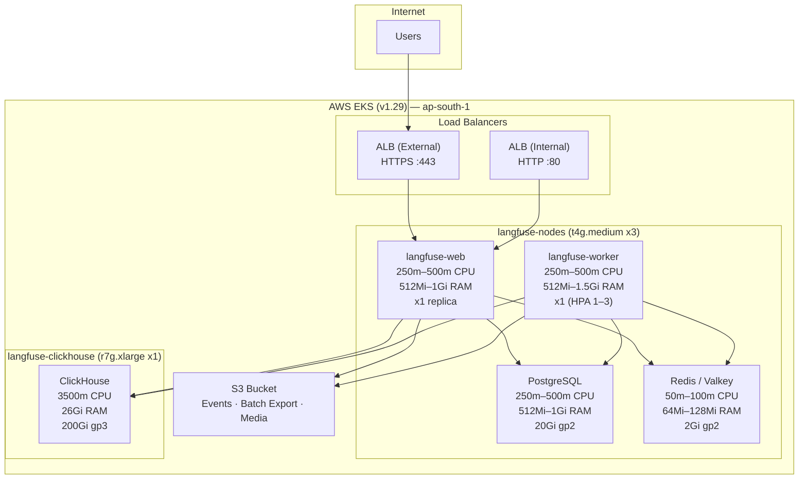
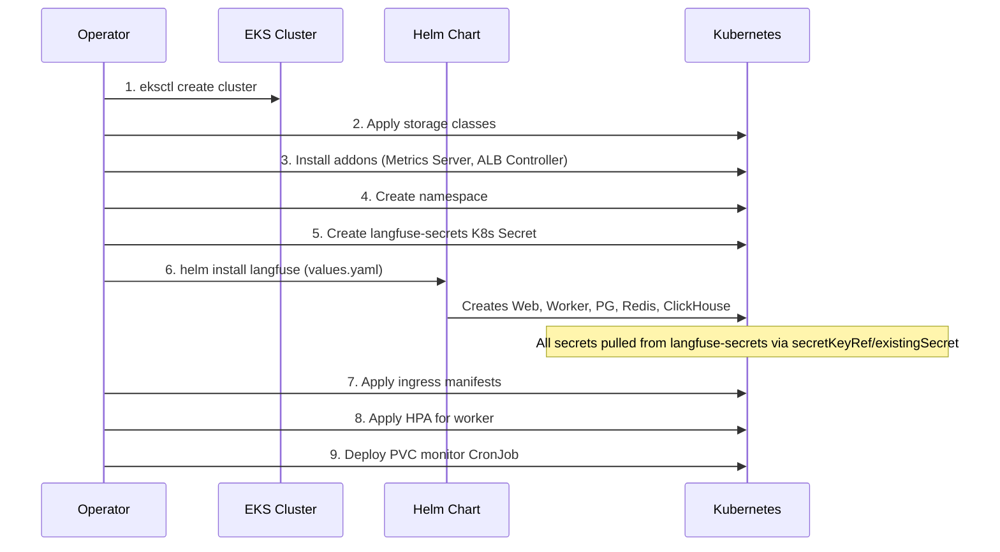
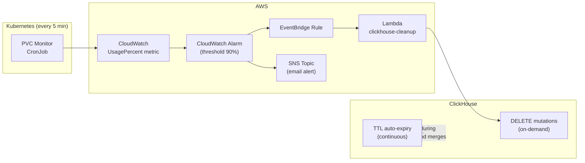

# Langfuse on EKS - Production Setup

Complete Kubernetes deployment for [Langfuse](https://langfuse.com) on AWS EKS, right-sized for **~8,000 chats/day**.

Reference: https://langfuse.com/self-hosting/deployment/kubernetes-helm

## Architecture Overview



## Deployment Flow



## Node Groups

| Node Group | Instance Type | Arch | Count | Purpose |
|---|---|---|---|---|
| `langfuse-nodes` | t4g.medium (2 vCPU, 4 GiB) | ARM64 | 3 (min 2, max 5) | Web, Worker, PostgreSQL, Redis |
| `langfuse-clickhouse` | r7g.xlarge (4 vCPU, 32 GiB) | ARM64 | 1 | Dedicated ClickHouse node |

The ClickHouse node has a taint (`dedicated=clickhouse:NoSchedule`) so only ClickHouse pods are scheduled there.

## Resource Allocation

| Component | CPU (req / limit) | Memory (req / limit) | Replicas | PVC Size | StorageClass |
|---|---|---|---|---|---|
| langfuse-web | 250m / 500m | 512Mi / 1Gi | 1 | — | — |
| langfuse-worker | 250m / 500m | 512Mi / 1536Mi | 1 (HPA 1–3) | — | — |
| PostgreSQL | 250m / 500m | 512Mi / 1Gi | 1 | 20Gi | gp2 |
| Redis (Valkey) | 50m / 100m | 64Mi / 128Mi | 1 | 2Gi | gp2 |
| ClickHouse | 3500m / 3500m | 26Gi / 26Gi | 1 | 200Gi | gp3 |

**Capacity check:** General workloads baseline (~800m CPU, ~1.6Gi RAM) fits comfortably within 3x t4g.medium (~5.4 allocatable CPU, ~10.5Gi allocatable RAM). ClickHouse (3.5C/26Gi) fits within r7g.xlarge (4C/32Gi) after kubelet overhead.

## Directory Structure

```
langfuse-k8/
├── README.md
├── cluster/
│   ├── eksctl-cluster.yaml              # EKS cluster (auto-creates VPC)
│   ├── eksctl-cluster-existing-vpc.yaml # EKS cluster (existing VPC — fill in IDs)
│   └── storage-classes.yaml             # gp2 (default) and gp3 storage classes
├── addons/
│   ├── metrics-server.yaml       # Kubernetes Metrics Server v0.8.0
│   └── aws-load-balancer-controller.yaml  # ALB Ingress Controller v3.0.0
├── helm/
│   ├── values.yaml               # Main Langfuse Helm values (all S3 config included)
│   └── values-secrets.example.yaml # K8s Secret manifest template (langfuse-secrets)
├── manifests/
│   ├── namespace.yaml            # langfuse namespace
│   ├── ingress-external.yaml     # Internet-facing ALB (HTTPS)
│   ├── ingress-internal.yaml     # Internal ALB (HTTP)
│   ├── clickhouse-nodeport.yaml  # NodePort service for ClickHouse access
│   ├── clickhouse-overrides.yaml # ClickHouse reference spec (for manual patching if needed)
│   ├── persistent-volumes.yaml   # PVC reference: ClickHouse (200Gi), PostgreSQL (20Gi), Redis (2Gi)
│   ├── hpa-worker.yaml           # HPA for langfuse-worker (1–3 replicas)
│   └── pvc-monitor/
│       ├── serviceaccount.yaml   # SA for PVC monitoring CronJob
│       ├── rbac.yaml             # Role + RoleBinding for pod exec
│       └── cronjob.yaml          # CronJob pushing PVC metrics to CloudWatch
├── maintenance/
│   ├── clickhouse-ttl.sql        # ClickHouse TTL DDL (proactive row expiry)
│   └── clickhouse-cleanup-lambda/
│       ├── lambda_function.py    # Lambda: emergency ClickHouse cleanup
│       └── terraform/
│           ├── main.tf           # Lambda + Alarm + EventBridge pipeline
│           ├── variables.tf      # Terraform variables
│           └── outputs.tf        # Terraform outputs
└── iam/
    ├── s3-policy.json            # IAM policy for Langfuse S3 bucket access
    ├── cloudwatch-policy.json    # IAM policy for PVC monitor CloudWatch metrics
    ├── ebs-csi-policy.json       # IAM policy for EBS CSI driver
    ├── alb-controller-policy.json # IAM policy for ALB controller
    └── lambda-clickhouse-role-policy.json # IAM role reference for cleanup Lambda
```

## Prerequisites

- AWS CLI configured with appropriate permissions
- `eksctl` >= 0.170.0
- `kubectl` >= 1.28
- `helm` >= 3.14
- An S3 bucket created for Langfuse storage
- An ACM certificate for your domain (for external HTTPS ingress)

## Deployment Steps

### 1. Create EKS Cluster

Two cluster configs are provided:

| Config | When to use |
|---|---|
| `cluster/eksctl-cluster.yaml` | Auto-creates a new VPC — simpler, good for dedicated environments |
| `cluster/eksctl-cluster-existing-vpc.yaml` | Uses an existing VPC — for enterprise / shared-VPC setups (fill in subnet & VPC IDs) |

```bash
# Option A: New VPC (default)
eksctl create cluster -f cluster/eksctl-cluster.yaml

# Option B: Existing VPC (edit the file first — fill in vpc/subnet IDs)
eksctl create cluster -f cluster/eksctl-cluster-existing-vpc.yaml
```

**VPC prerequisites** (relevant for both options, but especially Option B):
- VPC must have **DNS hostnames** and **DNS resolution** enabled
- At least **2 AZs** with both public and private subnets
- Private subnets need a **NAT Gateway** route (for ECR pulls, CloudWatch, etc.)
- Public subnets need an **Internet Gateway** route (for ALB)
- Recommended CIDR: `/16` (e.g. `10.0.0.0/16`) — EKS assigns pod IPs from VPC CIDR via VPC CNI
- Subnet tags: `kubernetes.io/cluster/<cluster-name>: shared` on all subnets, `kubernetes.io/role/elb: 1` on public, `kubernetes.io/role/internal-elb: 1` on private

### 2. Install Storage Classes

```bash
kubectl apply -f cluster/storage-classes.yaml
```

### 3. Install Addons

```bash
# Metrics Server (required for HPA)
kubectl apply -f addons/metrics-server.yaml

# AWS Load Balancer Controller
# First create the IRSA (see comments in the file for eksctl commands)
# Then install via Helm:
helm repo add eks https://aws.github.io/eks-charts
helm repo update
helm install aws-load-balancer-controller eks/aws-load-balancer-controller \
  -n kube-system \
  --set clusterName=langfuse-cluster \
  --set serviceAccount.create=false \
  --set serviceAccount.name=aws-load-balancer-controller \
  --set region=ap-south-1 \
  --set vpcId=<YOUR_VPC_ID>
```

### 4. Create Namespace

```bash
kubectl apply -f manifests/namespace.yaml
```

### 5. Create IAM User and S3 Bucket

```bash
# Create S3 bucket
aws s3 mb s3://<S3_BUCKET_NAME> --region ap-south-1

# Create IAM user for Langfuse
aws iam create-user --user-name langfuse-s3-user

# Attach S3 policy
aws iam put-user-policy \
  --user-name langfuse-s3-user \
  --policy-name LangfuseS3Access \
  --policy-document file://iam/s3-policy.json

# Create access keys
aws iam create-access-key --user-name langfuse-s3-user
# Save the AccessKeyId and SecretAccessKey for the langfuse-secrets K8s Secret
```

### 6. Create the `langfuse-secrets` K8s Secret

All sensitive values (database passwords, S3 credentials, encryption keys, etc.) are stored in a single K8s Secret named `langfuse-secrets`. The helm values reference it via `secretKeyRef` / `existingSecret`.

```bash
# Copy the example manifest and fill in real values
cp helm/values-secrets.example.yaml langfuse-secrets.yaml
# Edit langfuse-secrets.yaml — fill in every "" placeholder

# Apply the Secret
kubectl apply -f langfuse-secrets.yaml
```

> **Important:** Create this Secret before running `helm install`. Do not commit the filled-in file to git.

### 7. Deploy Langfuse via Helm

```bash
helm repo add langfuse https://langfuse.github.io/langfuse-k8s
helm repo update
helm install langfuse langfuse/langfuse \
  -n langfuse \
  -f helm/values.yaml
```

All S3 configuration uses the chart's native `s3.*` structured fields. All secrets are pulled from the `langfuse-secrets` K8s Secret — no `-f values-secrets.yaml` overlay or post-install patching needed.

### 8. Apply Ingress

```bash
# Edit the host and ACM certificate ARN in the ingress files
kubectl apply -f manifests/ingress-external.yaml
kubectl apply -f manifests/ingress-internal.yaml
```

### 9. Apply HPA

```bash
kubectl apply -f manifests/hpa-worker.yaml
```

### 10. Deploy PVC Monitor

```bash
kubectl apply -f manifests/pvc-monitor/serviceaccount.yaml
kubectl apply -f manifests/pvc-monitor/rbac.yaml
kubectl apply -f manifests/pvc-monitor/cronjob.yaml
```

### 11. (Optional) ClickHouse NodePort

```bash
kubectl apply -f manifests/clickhouse-nodeport.yaml
```

## Maintenance — ClickHouse Data Retention

ClickHouse system logs and application tables grow unbounded and can bloat the 200Gi PVC. Two complementary strategies keep disk usage in check:

1. **TTL (proactive)** — Native ClickHouse row expiry. Rows are dropped automatically during background merges. Prevents bloat from ever reaching critical levels.
2. **Lambda cleanup (reactive)** — Emergency safety net. Fires only when PVC usage hits 90%, triggered via CloudWatch alarm + EventBridge.



### Retention Periods

| Table | Type | TTL Retention | Lambda Retention |
|---|---|---|---|
| `default.observations` | App data | 30 days | 30 days |
| `default.traces` | App data | 30 days | 30 days |
| `system.opentelemetry_span_log` | System log | 10 days | 10 days |
| `system.query_log` | System log | 10 days | 10 days |
| `system.processors_profile_log` | System log | 10 days | 10 days |

### Step 1: Apply ClickHouse TTL (recommended — run once)

Connect to ClickHouse and run the TTL statements:

```bash
# Via clickhouse-client (port-forward or NodePort)
kubectl exec -n langfuse langfuse-clickhouse-shard0-0 -- \
  clickhouse-client --password <CLICKHOUSE_PASSWORD> \
  --multiquery < maintenance/clickhouse-ttl.sql

# Or via HTTP interface (NodePort 30123)
curl "http://<NODE_IP>:30123/?user=default&password=<CLICKHOUSE_PASSWORD>" \
  --data "ALTER TABLE default.observations MODIFY TTL created_at + INTERVAL 30 DAY"
# Repeat for each statement in maintenance/clickhouse-ttl.sql
```

TTL takes effect on background merges. To force immediate cleanup:

```sql
OPTIMIZE TABLE default.observations FINAL;
OPTIMIZE TABLE default.traces FINAL;
```

### Networking Prerequisites (for Lambda)

The cleanup Lambda must run **inside the EKS VPC** to reach the ClickHouse NodePort. Gather these values before running Terraform:

**VPC & Subnets** — Lambda needs private subnets in the EKS VPC:

```bash
# Get the VPC ID
aws eks describe-cluster --name langfuse-cluster \
  --query "cluster.resourcesVpcConfig.vpcId" --output text

# List private subnets in that VPC
VPC_ID=<output from above>
aws ec2 describe-subnets --filters "Name=vpc-id,Values=$VPC_ID" \
  --query "Subnets[?MapPublicIpOnLaunch==\`false\`].[SubnetId,AvailabilityZone]" \
  --output table
```

**Security Group** — simplest option is to reuse the EKS cluster security group:

```bash
aws eks describe-cluster --name langfuse-cluster \
  --query "cluster.resourcesVpcConfig.clusterSecurityGroupId" --output text
```

> The ClickHouse node's security group must allow **inbound TCP on port 30123** (NodePort) from the Lambda security group. If reusing the cluster SG, this is typically already allowed.

**ClickHouse Host** — the private IP of the ClickHouse node:

```bash
kubectl get nodes -l nodegroup=clickhouse -o wide
# Use the INTERNAL-IP column
```

> **Caveat:** This IP changes if the node is replaced (scaling event, node recycle, spot interruption). For production stability, consider placing an NLB or Route 53 private hosted zone record in front of the node.

**ClickHouse Password** — currently passed as a plaintext Lambda environment variable. For production, consider storing in AWS SSM Parameter Store (`SecureString`) and reading at Lambda runtime.

### Step 2: Deploy Lambda + Alarm Pipeline (Terraform)

The Terraform in `maintenance/clickhouse-cleanup-lambda/terraform/` creates:
- Lambda function (`langfuse-clickhouse-cleanup`) — Python 3.12, VPC-attached
- CloudWatch alarm on `LangfusePVC` / `UsagePercent` (threshold 90%)
- EventBridge rule — triggers Lambda when alarm enters ALARM state
- SNS topic — email notification on alarm state changes
- IAM role with `AWSLambdaBasicExecutionRole` + `AWSLambdaVPCAccessExecutionRole`

```bash
cd maintenance/clickhouse-cleanup-lambda/terraform

# Initialize
terraform init

# Plan — review what will be created
terraform plan \
  -var="clickhouse_host=<CLICKHOUSE_NODE_IP>" \
  -var="clickhouse_password=<CLICKHOUSE_PASSWORD>" \
  -var="subnet_ids=[\"subnet-xxx\",\"subnet-yyy\"]" \
  -var="security_group_ids=[\"sg-xxx\"]" \
  -var="notification_email=ops@example.com"

# Apply
terraform apply \
  -var="clickhouse_host=<CLICKHOUSE_NODE_IP>" \
  -var="clickhouse_password=<CLICKHOUSE_PASSWORD>" \
  -var="subnet_ids=[\"subnet-xxx\",\"subnet-yyy\"]" \
  -var="security_group_ids=[\"sg-xxx\"]" \
  -var="notification_email=ops@example.com"
```

The Lambda requires the `requests` Python library. Either:
- Provide a Lambda layer ARN via `requests_layer_arn` variable (e.g., `Klayers-p312-requests`)
- Or bundle `requests` into the deployment zip

### Testing the Lambda

```bash
# Invoke manually to verify connectivity
aws lambda invoke \
  --function-name langfuse-clickhouse-cleanup \
  --payload '{}' \
  /dev/stdout
```

## IAM Policies Summary

| Policy | Purpose | Attached To |
|---|---|---|
| `iam/s3-policy.json` | S3 bucket read/write for event upload, batch export, media upload | IAM user `langfuse-s3-user` |
| `iam/cloudwatch-policy.json` | PutMetricData to `LangfusePVC` namespace | Node instance role or pvc-monitor SA |
| `iam/ebs-csi-policy.json` | EBS volume create/attach/detach/delete | IRSA for `ebs-csi-controller-sa` |
| `iam/alb-controller-policy.json` | ALB/NLB management, security groups, ACM | IRSA for `aws-load-balancer-controller` |
| `iam/lambda-clickhouse-role-policy.json` | VPC access + CloudWatch Logs for cleanup Lambda | Lambda execution role (created by Terraform) |

## EKS Addons Installed

| Addon | Version | Purpose |
|---|---|---|
| VPC CNI | latest | Pod networking |
| CoreDNS | latest | Cluster DNS |
| kube-proxy | latest | Service proxy |
| EBS CSI Driver | v1.52.1 | gp2/gp3 persistent volumes |
| Metrics Server | v0.8.0 | HPA resource metrics |
| AWS Load Balancer Controller | v3.0.0 | ALB/NLB ingress |

## Custom CloudWatch Metrics

The PVC monitor CronJob (every 5 min) pushes the following to CloudWatch namespace `LangfusePVC`:

| Metric | Description | Dimensions |
|---|---|---|
| `UsagePercent` | Disk usage percentage | ClusterName, Namespace, PVCName, PodName |
| `UsedGB` | Disk space used in GB | ClusterName, Namespace, PVCName, PodName |
| `TotalGB` | Total disk space in GB | ClusterName, Namespace, PVCName, PodName |

Monitored pods: `langfuse-clickhouse-shard0-0`, `langfuse-postgresql-0`, `langfuse-redis-primary-0`.

## S3 Configuration (Not MinIO)

This setup uses **AWS S3 directly** instead of MinIO. The helm chart's built-in MinIO (s3 subchart) is disabled with `s3.deploy: false`. Three S3 features are configured via the chart's native `s3.*` structured fields:

1. **Event Upload** — Stores trace/observation events
2. **Batch Export** — Enables batch data exports
3. **Media Upload** — Stores uploaded media files (max 1GB per file)

All three share the same S3 bucket and credentials. Credentials are stored in the `langfuse-secrets` K8s Secret and referenced via `s3.accessKeyId.secretKeyRef` / `s3.secretAccessKey.secretKeyRef`.

## Scaling Up

If traffic grows beyond ~8,000 chats/day, consider these incremental upgrades:

| Component | Current | Next Step | When |
|---|---|---|---|
| Worker replicas | 1 (HPA max 3) | Increase HPA max to 5 | CPU consistently >70% |
| Web replicas | 1 | Scale to 2 + add HPA | Response latency increases |
| General nodes | t4g.medium x3 | t4g.large x3 or increase max to 8 | Node CPU >80% sustained |
| ClickHouse node | r7g.xlarge | r7g.2xlarge (8C/64Gi) | Query latency or memory pressure |
| ClickHouse PVC | 200Gi | Expand via `kubectl patch` | Usage >70% (check CloudWatch) |
| PostgreSQL PVC | 20Gi | Expand via `kubectl patch` | Usage >70% |

## Upgrading

```bash
helm repo update
helm upgrade langfuse langfuse/langfuse \
  -n langfuse \
  -f helm/values.yaml
```

## Notes

- All secrets are stored in a single K8s Secret (`langfuse-secrets`) — no plaintext secrets in helm values
- S3 configuration uses the chart's native `s3.*` structured fields — no raw env var overrides
- Redis is actually Valkey 8.0.2 (bitnami's redis chart ships Valkey)
- ClickHouse image: `bitnamilegacy/clickhouse:25.2.1`
- The `langfuse-compute-nodes` node group (c5.2xlarge) from the original cluster has been removed — it was legacy and unused
